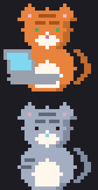
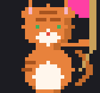
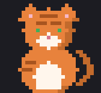
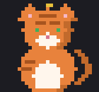
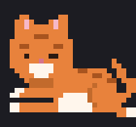
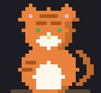

# Tokitty

<p align="center">
  
  
</p>

<p align="center">
  
  
  
  
  
</p>

<p align="center">
  <a href="https://github.com/nickwolf/tokitty/actions/workflows/ci.yml"></a>
</p>

A cat-themed desktop widget that shows your live Claude Code usage (session %, weekly %, reset countdowns, and extra-usage credits) with a pixel cat whose mood reflects how close you are to the limit. When a limit is capped, the cat rests, then stirs, then wakes up as the reset approaches, then hops back to sleep once usage clears. Does not assist with boredom and existential dread upon hitting weekly limit.

Once Tokitty has a snapshot, it keeps counting down using its own clock, no live connection needed to know when a known reset time arrives. If a poll fails (for example, the OAuth access token going stale between Claude Code sessions), Tokitty keeps showing that same cached countdown rather than blanking out, and only surfaces a small warning once the countdown should already be done and it still can't confirm the reset actually happened.

**Not affiliated with Anthropic (but I am open to it, *wink wink*).** "Claude" and "Claude Code" are Anthropic's marks, used here only to describe compatibility.

## Live activity (thinking / working / permission / done)

Optional, off by default. Run:

```bash
python -m tokitty --install-hooks
```

and the cat starts reacting to what a running Claude Code session is doing: a thinking pose while Claude is composing a response, a working pose (with the tool name) while it's mid-tool-call, a flag when Claude is waiting on you for a permission prompt, and a little done-hop when a work stretch wraps up. `python -m tokitty --uninstall-hooks` removes it again (the hook entries, not the copied hook script and session state files — delete `<config-dir>/tokitty/` manually if you want those gone). Existing running Claude Code sessions need to be restarted to pick up a fresh install or uninstall — hook edits aren't hot-reloaded.

On the primary Windows+WSL2 setup, Claude Code itself lives inside WSL, not in the Windows-native `~/.claude`. `--install-hooks` (and `--uninstall-hooks`) detect this automatically — same WSL-credentials probe the live-activity watcher uses — and target the `\\wsl.localhost\<distro>\home\<user>\.claude` dir instead, falling back to the Windows-local `~/.claude` only if WSL resolution fails (no WSL installed, no Claude Code credentials found, etc). Running `python3 -m tokitty --install-hooks` from inside WSL itself installs to the same dir and is equivalent — pick whichever shell is convenient.

## Two accounts

Tokitty can track two Claude Code accounts (e.g. personal + work) side by side in one window: two stacked cat/bar panes instead of one, sharing a single always-on-top card. This is opt-in and off by default — with no config, tokitty behaves exactly like v1, single account, single pane.

To turn it on, create `accounts.json` in tokitty's per-user state directory (the same directory `position.json` already lives in — `%LOCALAPPDATA%\Tokitty\` on Windows, `~/Library/Application Support/Tokitty` on macOS, `$XDG_CONFIG_HOME/tokitty` or `~/.config/tokitty` on Linux):

```json
{
  "accounts": [
    {"name": "personal", "config_dir": "\\\\wsl.localhost\\Ubuntu\\home\\cptsmidge\\.claude", "coat": "orange_tabby"},
    {"name": "work",     "config_dir": "\\\\wsl.localhost\\Ubuntu\\home\\cptsmidge\\.claude-work", "coat": "gray_tabby"}
  ]
}
```

Each entry's `config_dir` points at that account's Claude Code config directory (a WSL UNC path, a native path, whatever `--install-hooks` would target for that account). `coat` seeds that pane's initial coat preset (see [Customization](#customization) below for the five options and how overrides layer on top). If `accounts.json` is missing, empty, or fails to parse, tokitty falls straight back to v1's automatic single-account credential resolution — nothing in that path changes.

`TOKITTY_CREDENTIALS` (see Configuration above) still works, but only for single-account mode. If both `TOKITTY_CREDENTIALS` and a valid `accounts.json` are present, `accounts.json` wins and the env var is ignored; tokitty prints a startup warning to stderr so the conflict doesn't pass silently.

**The resting look is normal, not an error.** Work-account tokens typically expire around an hour after that account's Claude Code last ran. Outside work hours, the work pane will show its last-good numbers dimmed, a sleeping cat, and a "last seen HH:MM" label — that's the expected steady state for an idle account, not a warning condition, and no error styling is applied.

After creating or editing `accounts.json`, re-run `python -m tokitty --install-hooks` — the installer reads the same file and installs hooks into every listed account's config dir, not just the default one. As with any hook change, restart any Claude Code sessions that are already open; hook registration isn't hot-reloaded into a running session.

Setting `TOKITTY_DEBUG_ACCOUNTS=2` renders a fake two-pane card (one normal, one in the resting look) without needing a real `accounts.json` or a second account — handy for checking layout changes.

## Customization

Right-click a pane to change how its cat looks. **Coat** is a submenu of five presets — `orange_tabby`, `gray_tabby`, `black`, `white`, `calico` — picking one applies immediately and persists. **Customize…** opens a small dialog with a color-chooser button per overridable piece (coat base, coat shading, card background, bar color); each pick live-previews on the pane right away, and **Reset to preset** clears all four overrides back to the selected coat's stock colors.

Every override you make is saved to `customization.json`, in the same per-user state directory as `position.json` (see [Two accounts](#two-accounts) above for the exact path per OS), and reloaded on the next launch. In single-account mode the file has one entry keyed `"default"`; in dual-account mode it's keyed by account name, so each pane keeps its own coat and colors independently. `accounts.json`'s `coat` field (see above) is only ever a *seed* — it sets the coat the first time a pane appears with no stored customization yet. Once anything is saved to `customization.json`, that stored value wins over `accounts.json` from then on, even if you later edit `accounts.json`'s `coat`.

Each pane also gets a label under the sprite: in dual-account mode it defaults to the account's `name` from `accounts.json`; single-account mode has no default label (blank, matching v1). Right-click a pane and choose **Rename…** to set a custom name — it's saved to `customization.json` and persists across restarts. Clearing the name back to empty in the dialog reverts the pane to its default label (the account name in dual mode, blank in single mode).

With no `accounts.json` and no `customization.json`, tokitty renders exactly as v1 did: one pane, `orange_tabby`, no overrides, no label.

## Security & privacy

Tokitty only *reads* your local Claude Code OAuth credentials file: it never writes to it, never touches the refresh token, and never transmits the access token anywhere except in a single request to `api.anthropic.com`. Window position and, if you've customized any pane, coat/color/label choices (`position.json` and `customization.json`) are the only things Tokitty's core (non-live-activity) code persists, and both live in your OS's normal per-user config directory, never inside this repo. `customization.json` only ever contains preset names, `#rrggbb` hex strings, and label text you chose yourself through the right-click menu.

The live-activity feature above is opt-in and changes this picture only if you turn it on:

- **Installer.** `--install-hooks` registers a small hook script in each configured Claude Code config dir's `settings.json` (merged additively into any existing hooks, with a timestamped backup of `settings.json` taken first) and copies the hook script itself to `<config-dir>/tokitty/hook_writer.py`. It's idempotent — re-running it skips events already installed — and every entry it adds is tagged so `--uninstall-hooks` can remove exactly tokitty's entries and nothing else.
- **What the hook script sees.** Claude Code invokes it once per hook event (`UserPromptSubmit`, `PreToolUse`, `PostToolUse`, `Notification`, `Stop`, `SubagentStop`, `SessionEnd`) with that event's full JSON payload on stdin, which for `PreToolUse` includes the tool's input arguments. The script only reads that payload to decide what to write — it doesn't read prompts, file contents, or transcripts from anywhere else.
- **What it persists.** Per session, it writes one small JSON state file to `<config-dir>/tokitty/sessions/<session_id>.json` containing just the session id, the event name, a sequence number, a timestamp, and — for tool-call and agent events — the tool name and agent id. Prompt text, tool arguments/output, and file contents are never written to that file. On `SessionEnd` the file is deleted; tokitty's own watcher also deletes state files it judges stale (no update within its timeout window) so a crashed or killed session doesn't leave the cat stuck.
- **Failure behavior.** The hook script never writes to stdout and never exits non-zero, under any input — Claude Code treats hook stdout/exit code as live control signals (e.g. a non-zero exit can block the tool call), so the script is wrapped so nothing it does can ever interfere with your actual session. This is covered by tests, not just a claim.
- **Nothing leaves your machine.** None of this activity data is transmitted anywhere; it's read locally by tokitty's own watcher to drive the sprite.

Two-account mode (above) extends this picture the same way single-account mode already worked, just twice: with `accounts.json` present, tokitty reads OAuth credentials and (if hooks are installed) hook/session state from a second Claude Code config dir in addition to the default one. Nothing about what's read, persisted, or transmitted changes — it's the same read-only credentials access, the same opt-in hook installation, and the same locally-scoped session-state files, just applied per account instead of once. `accounts.json` itself only ever contains account names, config-dir paths, and coat choices you type in yourself.

## Platforms tested

- **Windows 11 + WSL2** (native Python via `pythonw.exe`, Claude Code running inside WSL2): the primary, recommended setup, verified end-to-end by hand. The full pipeline (credential resolution, WSL fallback, live API polling, mood/wake-sequence logic, rendering) runs against a real account, and the window itself — drag, always-on-top, sizing, text legibility, animation — is visually confirmed on a real desktop.
- **Linux, macOS, Windows — automated (CI badge above):** the full test suite runs on all three, on Python 3.10 and 3.14, for every change, and the real Tk window is booted headlessly on Linux (under `xvfb`) to confirm it constructs. So the shared logic — credential resolution, WSL-path handling, mood/wake sequencing, layout and sprite rendering — and, on Linux, GUI construction are covered wherever the badge is green.
- **Not yet hands-on:** interactive desktop use on native Linux and macOS (real-account polling and live window behaviour). The shared code paths are covered above, so it should work — but nobody has run it there interactively yet.

## Setup

### Windows (Claude Code in WSL2, recommended path)

1. Install Python 3.10+ from [python.org](https://www.python.org/) (bundles tkinter).
2. `git clone` this repo, then from the repo root: `pythonw.exe -m tokitty`

### Windows (Claude Code installed natively, no WSL)

Same as above: `resolve_credentials_source()` finds `~/.claude/.credentials.json` directly, no WSL bridge involved.

### Linux

1. `sudo apt install python3-tk` (or your distro's equivalent).
2. `python3 -m tokitty`

### macOS

1. Install Python from [python.org](https://www.python.org/) (recommended over Apple's system Python or some Homebrew builds, which can have flaky Tcl/Tk).
2. `python3 -m tokitty`

## Configuration

If Tokitty can't find your Claude Code credentials automatically (e.g. more than one install), set:

```bash
export TOKITTY_CREDENTIALS=/path/to/.claude/.credentials.json
```

## How this was built

Tokitty was built with [Claude](https://claude.com/product/claude-code) (Fable 5) using a subagent-driven-development workflow: an owner session designed the spec and implementation plan, then dispatched a fresh implementer subagent per task with a reviewer subagent checking spec compliance and code quality before each task landed. Model tiers were deliberately mixed: cheaper/faster models handled the mechanical, fully-specified logic modules (credentials, API client, locking, mood/wake-sequence state machine, formatting), while a standard-tier model handled the threading/integration work. The pixel-art sprites, the tkinter window, and the animation loop were built directly by the owner session rather than delegated, since that's the part where a bit of craft mattered most. The sprite templates were generated procedurally (simple shapes stamped onto a grid) to avoid hand-counting errors, then hand-tuned and baked in as static data.

The review loop caught and fixed several real bugs along the way: a monkeypatch self-recursion bug in a test, a refresh-request race condition in the polling worker (found by review, "fixed" once by the owner session in a way that introduced a *worse* regression, caught again by review, fixed properly on the third pass), a `wsl.exe` argv-mangling quirk found only by actually running the WSL-fallback code path against a real account instead of trusting mocked tests, and an unconditional `tkinter` import that would have silently broken the no-GUI-toolkit-needed `--debug-print` path. The commit history is the actual record of that process, not just the finished result.

## Known limitations (POC)

- This uses `api.anthropic.com/api/oauth/usage`, an **undocumented endpoint** that may change or disappear without notice.
- Running Tokitty *inside* WSL (via WSLg) is architecturally supported (same credential-resolution code path as native Linux), but has never actually been run: `python3-tk` isn't installed in the reference dev environment.
- Sprite art is composed from three reusable 28x26 pose templates (sitting calm, sitting alert, lying down) with per-state substitutions, not a fully independent illustration per state.

## Roadmap

See [docs/ROADMAP.md](docs/ROADMAP.md) — phased plan (higher-res sprites, live activity states with a permission flag, dual-account support, cat customization) plus the backlog (ntfy notifications, autostart, tray icon, per-model bars, click-to-pet, burn-rate projection, and more). Tracked as GitHub milestones/issues on this repo.

## License

MIT, see [LICENSE](LICENSE).
