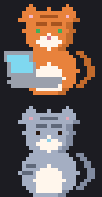
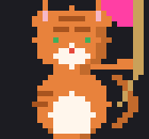
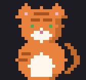
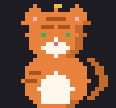
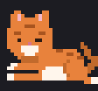
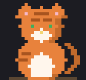

# Tokitty

<p align="center">
  
  
</p>

<p align="center">
  
  
  
  
  
</p>

<p align="center">
  <a href="https://github.com/nickwolf/tokitty/actions/workflows/ci.yml"></a>
</p>

A cat-themed desktop widget that shows your live Claude Code usage (session %, weekly %, reset countdowns, and extra-usage credits) with a pixel cat whose mood reflects how close you are to the limit. When a limit is capped, the cat rests, then stirs, then wakes up as the reset approaches, then hops back to sleep once usage clears. Does not assist with boredom and existential dread upon hitting weekly limit.

Once Tokitty has a snapshot, it keeps counting down using its own clock, no live connection needed to know when a known reset time arrives. If a poll fails (for example, the OAuth access token going stale between Claude Code sessions), Tokitty keeps showing that same cached countdown rather than blanking out, and only surfaces a small warning once the countdown should already be done and it still can't confirm the reset actually happened.

**Burn-rate projection.** When your current pace would hit a cap before the window resets, the status line says when: `session caps ~6:20 PM`. It tracks whichever limit lands first, and stays blank when you are coasting.

**Not affiliated with Anthropic (but I am open to it, *wink wink*).** "Claude" and "Claude Code" are Anthropic's marks, used here only to describe compatibility.

## Live activity (thinking / working / permission / done)

Optional, off by default. Run:

```bash
python -m tokitty --install-hooks
```

and the cat starts reacting to what a running Claude Code session is doing: a thinking pose while Claude is composing a response, a working pose (with the tool name) while it's mid-tool-call, a flag when Claude is waiting on you for a permission prompt, and a little done-hop when a work stretch wraps up. `python -m tokitty --uninstall-hooks` removes it again (the hook entries, not the copied hook script and session state files — delete `<config-dir>/tokitty/` manually if you want those gone). Existing running Claude Code sessions need to be restarted to pick up a fresh install or uninstall — hook edits aren't hot-reloaded.

On the primary Windows+WSL2 setup, Claude Code itself lives inside WSL, not in the Windows-native `~/.claude`. `--install-hooks` (and `--uninstall-hooks`) detect this automatically — same WSL-credentials probe the live-activity watcher uses — and target the `\\wsl.localhost\<distro>\home\<user>\.claude` dir instead, falling back to the Windows-local `~/.claude` only if WSL resolution fails (no WSL installed, no Claude Code credentials found, etc). Running `python3 -m tokitty --install-hooks` from inside WSL itself installs to the same dir and is equivalent — pick whichever shell is convenient.

## Autostart

Optional, off by default. Right-click any pane (or the tray icon) and check **Start at login** to have tokitty launch itself automatically the next time you log in: no installer, no admin rights, nothing outside your own user account. Unchecking it removes the same registration.

The mechanism is native to each OS and needs no third-party dependency: the `HKCU\Software\Microsoft\Windows\CurrentVersion\Run` registry value on Windows, a `LaunchAgent` plist at `~/Library/LaunchAgents/com.nickwolf.tokitty.plist` on macOS, and a `.desktop` file at `~/.config/autostart/tokitty.desktop` on Linux. The checkbox reflects the real OS registration, read when tokitty starts and again after you toggle it. Nothing is cached on disk, so removing the entry by hand is picked up the next time tokitty starts. It is not picked up mid-session: remove the entry externally while tokitty is running and the checkbox keeps showing the state it read at startup until you restart. On macOS, checking the box writes the plist but doesn't load it into the running session, so the change takes effect at your next login, not immediately.

`python -m tokitty --install-autostart` and `python -m tokitty --uninstall-autostart` do the same thing from the command line, for headless setup or scripting.

If tokitty's repo clone is moved, or the Python interpreter it was registered against changes, the registration can go stale and silently fail to launch at the next login with nothing on screen to explain it. tokitty checks for this itself at every startup and rewrites the registration if it's drifted, so as long as tokitty gets launched by hand at least once from wherever it now lives, the next automatic login launch self-heals. The one thing this can't fix: deleting the whole clone with no replacement leaves a permanently broken entry, since nothing is ever running to repair it. Uncheck **Start at login** (or run `--uninstall-autostart`) before deleting a clone that has autostart enabled.

## Accounts

Tokitty can track any number of Claude Code accounts side by side in one window: a pane per account instead of one, laid out in a grid once you're past four, sharing a single always-on-top card. This is opt-in and off by default. With no accounts configured, tokitty behaves exactly like v1, single account, single pane.

Right-click any pane and choose **Accounts…** to add, rename, or remove accounts, no config file editing needed. The dialog also lists any Claude Code installs it finds on its own (WSL-only for now) as one-click rows next to a manual "add by path" entry for anything it didn't find. Adding an account rolls it a random look; removing one only takes it out of the active list, its saved colorway and pattern stay on disk in case you add it back later. If tokitty starts with no accounts configured and finds more than one usable Claude Code install, it opens the Accounts dialog on its own instead of guessing which one you meant.

After adding or removing an account, restart tokitty to see the new pane layout, and restart any already-open Claude Code sessions to pick up the hook change (hook registration isn't hot-reloaded into a running session).

Accounts still live in `accounts.json` in tokitty's per-user state directory (the same directory `position.json` already lives in, `%LOCALAPPDATA%\Tokitty\` on Windows, `~/Library/Application Support/Tokitty` on macOS, `$XDG_CONFIG_HOME/tokitty` or `~/.config/tokitty` on Linux), but the dialog is the supported way to manage it now. Each entry's `config_dir` points at that account's Claude Code config directory (a WSL UNC path, a native path, whatever `--install-hooks` would target for that account); `name` is an opaque identity slug the dialog assigns on add, not something meant to be typed by hand.

`TOKITTY_CREDENTIALS` (see Configuration above) still works, but only when no accounts are configured. If both `TOKITTY_CREDENTIALS` and a valid `accounts.json` are present, `accounts.json` wins and the env var is ignored; tokitty prints a startup warning to stderr so the conflict doesn't pass silently.

**The resting look is normal, not an error.** Work-account tokens typically expire around an hour after that account's Claude Code last ran. Outside work hours, an idle account's pane will show its last-good numbers dimmed, a sleeping cat, and a "last seen HH:MM" label. That's the expected steady state for an idle account, not a warning condition, and no error styling is applied.

**Multi-account mode requires credential *files*.** Each `config_dir` entry is
read as `<config_dir>/.credentials.json`, so on macOS, where Claude Code stores
credentials in the login Keychain, tokitty can't discover or add a second
Keychain-backed account yet. When there's no credentials file on disk, the
Accounts dialog shows a read-only "Default macOS account (Keychain)" row in
place of a normal account row, since the Keychain holds one item per macOS
user with no per-account identity to key on.

Setting `TOKITTY_DEBUG_ACCOUNTS=2` renders a fake two-pane card (one normal, one in the resting look) without needing any real accounts configured, handy for checking layout changes.

## Customization

A cat's look is two independent axes: a **colorway** (its tone palette) times a **pattern** (which tone each body region takes). Right-click a pane to change either. **Colorway ▸** is a radio submenu of six — `orange`, `gray`, `black`, `white`, `cream`, `brown` — and **Pattern ▸** is a radio submenu of nine — `solid`, `tabby`, `bicolor`, `tabby_white`, `calico`, `tuxedo`, `socks`, `colorpoint`, `van`. Picking either applies immediately and persists, so six colorways × nine patterns give 54 built-in looks. `colorpoint` and `van` pale the body toward the colorway's light tone, so they read best on the lighter colorways.

Two ways to let tokitty pick for you: **Randomize** rolls a fresh colorway + pattern for that pane and saves it, and **Surprise me** (a checkbox) re-rolls every pane to a new look on each launch — off by default, so your chosen look sticks. Both only ever roll from the built-in colorways and patterns, never free-form colors.

**Customize…** opens a small dialog with a color-chooser button per overridable piece (coat base, coat shading, card background, bar color); each pick live-previews on the pane right away, and **Reset to preset** clears all four overrides back to the current colorway + pattern's stock colors.

Every choice you make is saved to `customization.json`, in the same per-user state directory as `position.json` (see [Accounts](#accounts) above for the exact path per OS), and reloaded on the next launch. In single-account mode the file has one entry keyed `"default"`; with accounts configured it's keyed by each account's identity slug, so each pane keeps its own look and colors independently. It stores `colorway` + `pattern`; older files that stored a single `coat` name are migrated automatically on load. `accounts.json`'s `coat` field (see above) is only ever a *seed* for the legacy single-`coat` shape; it sets the look the first time a pane appears with no stored customization yet, and has no effect once a look is saved.

Each pane also gets a label under the sprite. Right-click a pane and choose **Rename…** to set one; it's saved to `customization.json` and persists across restarts. A pane with no name set shows no label, matching how single-account mode has always worked. Clearing the name back to empty in the dialog reverts to no label. The Accounts dialog's own account list shows a generic placeholder ("Cat 1", "Cat 2", and so on) for any account that hasn't been renamed yet, just for that list; it doesn't change what's shown on the pane itself.

With no `accounts.json` and no `customization.json`, tokitty runs as a single pane and, on first launch, rolls one random look and saves it — so a fresh install gets its own cat that then stays put across restarts, rather than always starting orange tabby.

## Security & privacy

Tokitty only *reads* your local Claude Code OAuth credentials file: it never writes to it, never touches the refresh token, and never transmits the access token anywhere except in a single request to `api.anthropic.com`. Window position, your per-pane look/color/label choices, and two app-wide toggles (`position.json`, `customization.json`, and `settings.json` — the latter holding "show tray icon" and "surprise me") are the only things Tokitty's core (non-live-activity) code persists, and all live in your OS's normal per-user config directory, never inside this repo. `customization.json` only ever contains built-in colorway/pattern names, `#rrggbb` hex strings, and label text you chose yourself through the right-click menu. Autostart's on/off state is not among them: it lives entirely in the OS's own registration (a registry value, a LaunchAgent plist, or a desktop entry, depending on platform) and never in `settings.json`, so there is no stored copy to fall out of step with what the OS will actually do at your next login.

The live-activity feature above is opt-in and changes this picture only if you turn it on:

- **Installer.** `--install-hooks` registers a small hook script in each configured Claude Code config dir's `settings.json` (merged additively into any existing hooks, with a timestamped backup of `settings.json` taken first) and copies the hook script itself to `<config-dir>/tokitty/hook_writer.py`. It's idempotent — re-running it skips events already installed — and every entry it adds is tagged so `--uninstall-hooks` can remove exactly tokitty's entries and nothing else.
- **What the hook script sees.** Claude Code invokes it once per hook event (`UserPromptSubmit`, `PreToolUse`, `PostToolUse`, `Notification`, `Stop`, `SubagentStop`, `SessionEnd`) with that event's full JSON payload on stdin, which for `PreToolUse` includes the tool's input arguments. The script only reads that payload to decide what to write — it doesn't read prompts, file contents, or transcripts from anywhere else.
- **What it persists.** Per session, it writes one small JSON state file to `<config-dir>/tokitty/sessions/<session_id>.json` containing just the session id, the event name, a sequence number, a timestamp, and — for tool-call and agent events — the tool name and agent id. Prompt text, tool arguments/output, and file contents are never written to that file. On `SessionEnd` the file is deleted; tokitty's own watcher also deletes state files it judges stale (no update within its timeout window) so a crashed or killed session doesn't leave the cat stuck.
- **Failure behavior.** The hook script never writes to stdout and never exits non-zero, under any input — Claude Code treats hook stdout/exit code as live control signals (e.g. a non-zero exit can block the tool call), so the script is wrapped so nothing it does can ever interfere with your actual session. This is covered by tests, not just a claim.
- **Nothing leaves your machine.** None of this activity data is transmitted anywhere; it's read locally by tokitty's own watcher to drive the sprite.

**macOS Keychain.** On macOS the credentials are read from the login Keychain
instead of a file. Tokitty's access stays read-only — it never writes to the
item and never touches the refresh token. One thing worth knowing before you
click **Always Allow**: macOS Keychain ACLs are per-*binary*, and the binary
being authorized is `/usr/bin/security`. So granting it persistent access means
any process running as you can afterwards read that token by shelling out to
`security`, without a prompt. That is a property of how Keychain authorization
works, not something tokitty can tighten — a narrower grant would require
tokitty to be a signed app bundle with a stable identity rather than a Python
script. Choosing **Allow** instead of **Always Allow** grants a single read,
and while the token stays valid tokitty's cache means that's roughly one
prompt per token lifetime. But the cache is invalidated the moment the token
expires — deliberately, since that's how tokitty notices Claude Code has
refreshed it — so once nothing is refreshing the token (the idle-account
resting look above, e.g. outside work hours), every retry on the 30s→600s
backoff is a cache miss and re-prompts: on the order of fifty prompts
overnight, not one. If you leave tokitty running unattended, use
**Always Allow**.

Multi-account mode (above) extends this picture the same way single-account mode already worked, just once per configured account: tokitty reads OAuth credentials and (if hooks are installed) hook/session state from each account's Claude Code config dir. Nothing about what's read, persisted, or transmitted changes. It's the same read-only credentials access, the same opt-in hook installation, and the same locally-scoped session-state files, just applied per account instead of once. `accounts.json` itself only ever contains an identity slug and a config-dir path per account, both assigned by the Accounts dialog, not typed in by hand.

## Platforms tested

- **Windows 11 + WSL2** (native Python via `pythonw.exe`, Claude Code running inside WSL2): the primary, recommended setup, verified end-to-end by hand. The full pipeline (credential resolution, WSL fallback, live API polling, mood/wake-sequence logic, rendering) runs against a real account, and the window itself — drag, always-on-top, sizing, text legibility, animation — is visually confirmed on a real desktop.
- **Linux, macOS, Windows — automated (CI badge above):** the full test suite runs on all three, on Python 3.10 and 3.14, for every change, and the real Tk window is booted headlessly on Linux (under `xvfb`) to confirm it constructs. So the shared logic — credential resolution, WSL-path handling, mood/wake sequencing, layout and sprite rendering — and, on Linux, GUI construction are covered wherever the badge is green.
- **macOS 15 (Apple silicon, python.org Python 3.14 + Tk 9.0) — hands-on, with caveats:** credential resolution from the login Keychain, live API polling against a real account, and the window itself (drag, always-on-top, right-click menu, **Refresh now**) confirmed by hand on 2026-08-04. The denial path was exercised for real: deny the Keychain prompt, get the dimmed card with a recovery hint, then recover via **Refresh now** without restarting. Two caveats, both tracked:
  - **No tray icon on macOS.** The tray is disabled there automatically, whatever `tray_enabled` is set to, and the "Show tray icon" menu entry is hidden. pystray's darwin backend needs `NSApplication.run()` on the main thread, and Tk's `mainloop()` already owns it, so starting a tray aborts the process rather than failing gracefully ([#45](https://github.com/nickwolf/tokitty/issues/45)). Nothing is lost from the menu: every action, **Refresh now** included, is on the window's right-click menu. A native menu-bar item would be the real fix ([#44](https://github.com/nickwolf/tokitty/issues/44) touches the same main-thread question).
  - **The system menu bar stays.** Removing it needs a real `.app` bundle with `LSUIElement=1`; no runtime call can do it, because Tk owns and rebuilds that menu ([#44](https://github.com/nickwolf/tokitty/issues/44)).

  One path is covered by tests but *not* by hand: a Keychain denial that happens **after** a successful poll, where a cached snapshot is already on screen. Reproducing it needs an expired access token, so it was not practical to trigger live.
- **Not yet hands-on:** interactive desktop use on native Linux (real-account polling and live window behaviour). The shared code paths are covered above, so it should work — but nobody has run it there interactively yet.

## Setup

### Windows (Claude Code in WSL2, recommended path)

1. Install Python 3.10+ from [python.org](https://www.python.org/) (bundles tkinter).
2. `git clone` this repo, then from the repo root: `pythonw.exe -m tokitty`

### Windows (Claude Code installed natively, no WSL)

Same as above: `resolve_credentials_source()` finds `~/.claude/.credentials.json` directly, no WSL bridge involved.

### Linux

1. `sudo apt install python3-tk` (or your distro's equivalent).
2. `python3 -m tokitty`

### macOS

1. Install Python from [python.org](https://www.python.org/) (recommended over
   Apple's system Python — which is 3.9 and below this project's 3.10 floor —
   or some Homebrew builds, which can have flaky Tcl/Tk).
2. `python3 -m tokitty`

Claude Code on macOS keeps its OAuth credentials in your **login Keychain**, not
in `~/.claude/.credentials.json`, so tokitty reads them from there. The first
read raises a macOS authorization prompt; choose **Always Allow** unless you
want to re-authorize roughly once an hour. If you deny it, the cat shows
"Keychain denied, Refresh to retry" and stops asking — grant access, then
right-click ▸ **Refresh now** to recover. No restart needed.

## Configuration

If Tokitty can't find your Claude Code credentials automatically (e.g. more than one install), set:

```bash
export TOKITTY_CREDENTIALS=/path/to/.claude/.credentials.json
```

## How this was built

Tokitty was built with [Claude](https://claude.com/product/claude-code) (Fable 5) using a subagent-driven-development workflow: an owner session designed the spec and implementation plan, then dispatched a fresh implementer subagent per task with a reviewer subagent checking spec compliance and code quality before each task landed. Model tiers were deliberately mixed: cheaper/faster models handled the mechanical, fully-specified logic modules (credentials, API client, locking, mood/wake-sequence state machine, formatting), while a standard-tier model handled the threading/integration work. The pixel-art sprites, the tkinter window, and the animation loop were built directly by the owner session rather than delegated, since that's the part where a bit of craft mattered most. The sprite templates were generated procedurally (simple shapes stamped onto a grid) to avoid hand-counting errors, then hand-tuned and baked in as static data.

The review loop caught and fixed several real bugs along the way: a monkeypatch self-recursion bug in a test, a refresh-request race condition in the polling worker (found by review, "fixed" once by the owner session in a way that introduced a *worse* regression, caught again by review, fixed properly on the third pass), a `wsl.exe` argv-mangling quirk found only by actually running the WSL-fallback code path against a real account instead of trusting mocked tests, and an unconditional `tkinter` import that would have silently broken the no-GUI-toolkit-needed `--debug-print` path. The commit history is the actual record of that process, not just the finished result.

## Known limitations (POC)

- This uses `api.anthropic.com/api/oauth/usage`, an **undocumented endpoint** that may change or disappear without notice.
- Running Tokitty *inside* WSL (via WSLg) is architecturally supported (same credential-resolution code path as native Linux), but has never actually been run: `python3-tk` isn't installed in the reference dev environment.
- Sprite art is composed from three reusable 28x26 pose templates (sitting calm, sitting alert, lying down) with per-state substitutions, not a fully independent illustration per state.

## Roadmap

See [docs/ROADMAP.md](docs/ROADMAP.md) — phased plan (higher-res sprites, live activity states with a permission flag, dual-account support, cat customization) plus the backlog (ntfy notifications, tray icon, per-model bars, click-to-pet, and more). Tracked as GitHub milestones/issues on this repo.

## License

MIT, see [LICENSE](LICENSE).
